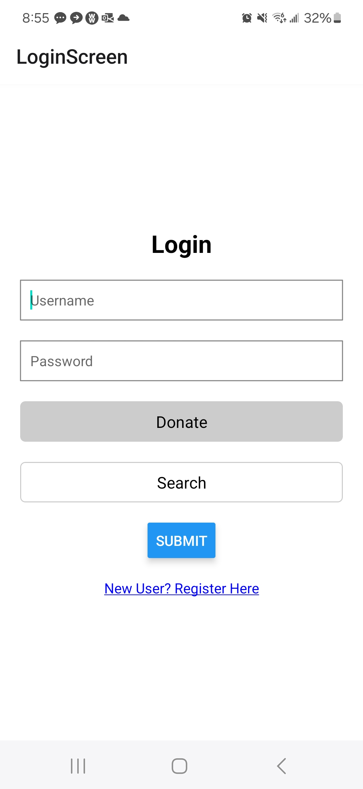
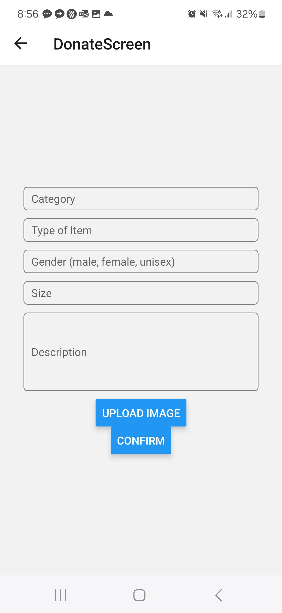
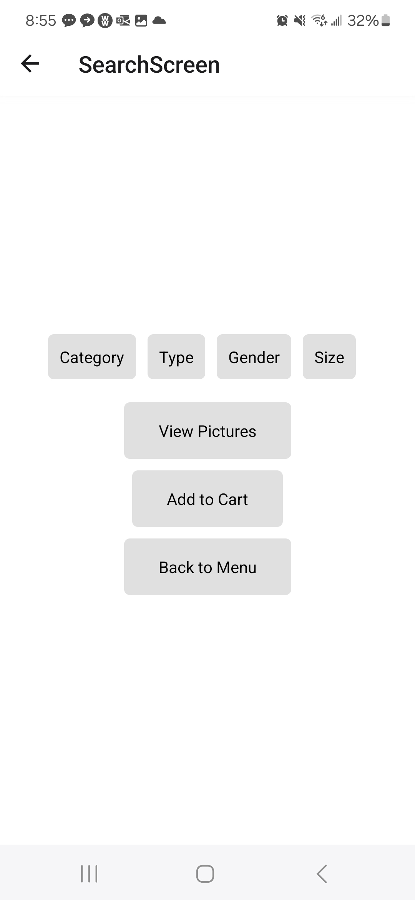
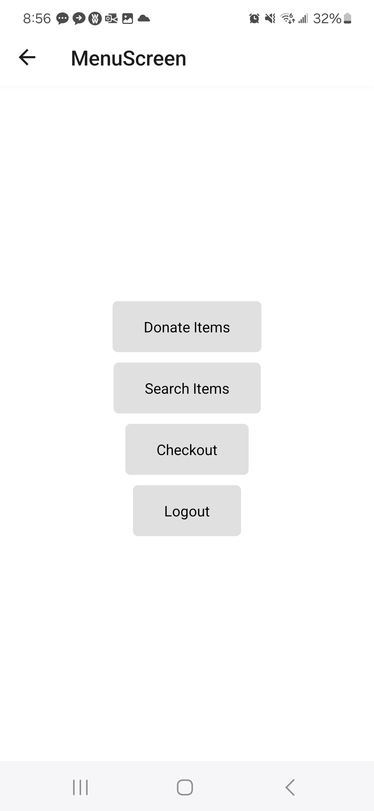

# mobile_app_final

# PROJECT: 
Create an app in React Native that will enable two types of experiences: donate and shop.  Where people can simply pay for the cost of shipping instead of the price they formerly paid in the stores.  
1. When donating you will be prompted to take a picture of the item, enter a category (children, adults), enter the type of item (shirt, pants, other) from a drop-down list, input gender (male, female, unisex), provide a size, and give a description if desired.
2. When shopping you can search on those same filters

# PICTURES: 

**LOGIN SCREEN - WILL TAKE THEM EITHER TO THE DONATE OR SEARCH SCREEN DEPENDING ON THEIR SELECTION**

**DONATE SCREEN WHERE USERS CAN POST THEIR ITEMS**

**SEARCH SCREEN WHERE USERS CAN LOOK FOR CLOTHES TO BUY**

**MENU WHERE USERS WILL GO WHEN THEY ARE FINISHED WITH EITHER THE DONATE OR THE SEARCH SCREENS**

